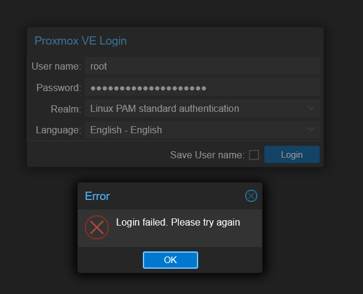

# Proxmox – Kein Root-Login möglich: Analyse und Behebung

Wenn du dich **nicht einmal lokal als root am Server einloggen kannst**, liegt der Fehler sehr wahrscheinlich auf Systemebene – etwa bei:

- der **Systemzeit**, wenn z. B. Token oder Zertifikate für den Root-Login abgelehnt werden,
- einem **gesperrten Root-Account**, z. B. durch PAM oder Lock-Dateien,
- einer **beschädigten Datei wie `/etc/shadow` oder `/etc/pve`**,
- oder einem **fehlerhaften Dateisystem / Bootproblem**.

---

## 🔧 1. In den Recovery-/Notfallmodus booten

### GRUB-Bootzeile bearbeiten:
1. Starte den Server neu.
2. Wenn das **GRUB-Menü** erscheint, wähle den Standardkernel, aber **drücke `e`**, um ihn zu bearbeiten.
3. Suche die Zeile, die mit `linux` beginnt – sie endet meist mit `quiet`.
4. Ersetze `quiet` durch:  
   ```
   init=/bin/bash
   ```
5. Drücke `Ctrl+X` oder `F10`, um zu booten.

---

## 🔧 2. Root-Zugriff erhalten & Dateisystem vorbereiten

```bash
mount -o remount,rw /
```

---

## 🔍 3. Uhrzeit prüfen und ggf. setzen

```bash
date
date -s "2025-05-18 18:30:00"
hwclock --systohc
```

---

## 🔍 4. Root-Login reparieren

### a) Root-Passwort zurücksetzen:

```bash
passwd
```

### b) `shadow`-Eintrag prüfen:

```bash
grep root /etc/shadow
```

Falls dort `root:!` oder `root:*` steht → `nano /etc/shadow`  
Ersetze `!` oder `*` durch den tatsächlichen Passwort-Hash (oder setze ein neues Passwort).

---

## 🔍 5. Zusätzliche Prüfungen

### a) Dateisystem voll?

```bash
df -h
```

### b) `/etc/pve` verfügbar?

```bash
ls -la /etc/pve
```

---

## 🔄 6. Neustart vorbereiten

```bash
exec /sbin/init
# oder
reboot -f
```

---

## 🔁 Alternative: temporärer Admin-Account

Falls weiterhin kein Login möglich ist:

```bash
useradd -m -G sudo -s /bin/bash adminfix
passwd adminfix
```
